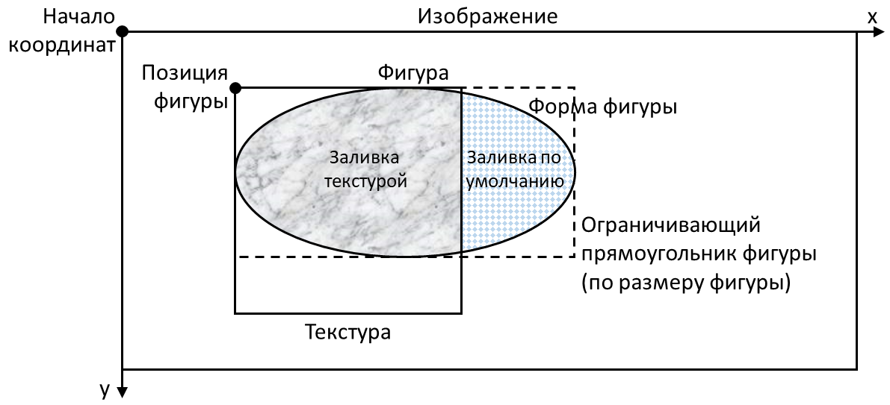

## Задание по программированию: Текстуры
## Инструкции
На лекциях вы познакомились с умным указателем shared_ptr, который обеспечивает совместное владение объектом. В данной задаче вам нужно будет реализовать классы фигур, которые можно отрисовывать на изображении, и которые совместно владеют заданной текстурой.

Среди доступных вам файлов вас в первую очередь будет интересовать файл Common.h. В нём приведён интерфейс IShape, который описывает фигуру. Существуют два вида фигур: прямоугольник и эллипс. Они указаны в перечислении ShapeType. Ваша задача реализовать функцию MakeShape, которая создаёт фигуру заданного вида.

Интерфейс IShape позволяет запрашивать и задавать ряд свойств фигуры: позицию, размер и текстуру. Также он позволяет клонировать фигуру с помощью метода Clone(). Это похоже на то, как если бы вы выбрали в редакторе графики фигуру и нажали Ctrl+C и Ctrl+V. Идея в том, что склонированная фигура использует ту же самую текстуру, что и оригинал. Это удобно, т.к. в общем случае текстура может занимать много памяти. Разумеется, в дальнейшем склонированной фигуре можно задать новую текстуру.

Объект текстуры должен быть удалён в тот момент, когда нет больше фигур, которые имеют данную текстуру. Это может произойти при удалении фигуры, или при назначении фигуре другой текстуры.

Кроме того, интерфейс IShape позволяет отрисовать текущую фигуру на заданном изображении с помощью метода Draw(). Отрисовка происходит по следующим правилам:

* Из позиции и размера фигуры формируется её ограничивающий прямоугольник
* Внутри ограничивающего прямоугольника формируется множество точек, принадлежащих фигуре - форма фигуры (если фигура это прямоугольник, то форма фигуры совпадает с ограничивающим прямоугольником)
* Текстура накладывается на ограничивающий прямоугольник таким образом, чтобы их левый верхний угол совпадал
* Заполняются пиксели изображения, попадающие внутрь формы фигуры
* Пиксели, что находятся на пересечении формы фигуры и текстуры, заполняются пикселями текстуры (если текстура отсутствует, можно считать, что она нулевого размера)
* Остальные пиксели заполняются заливкой по умолчанию - символом "." (точка)
* Если какие-то пиксели выходят за границы изображения, они просто игнорируются

В качестве примера правильной отрисовки следует посмотреть тесты, вызываемые из функции main() в файле main.cpp. В тестах создаётся канва (экземпляр класса Canvas). Канва это по сути автоматизированный редактор графики, который управляется через открытые методы. Например, метод AddShape() добавляет новую фигуру с помощью функции MakeShape(), которую вам нужно реализовать. А метод DuplicateShape() клонирует существующую фигуру, вызывая метод Clone(), который вам, опять же, нужно будет реализовать. Таким образом, с помощью тестов можно будет проверить корректность своей реализации. Однако будьте осторожны - как и в других заданиях, успешное прохождение открытых тестов есть необходимое, но не достаточное условие корректности вашей реализации. Своё решение опишите в файле Solution.cpp и присылайте его на проверку.

## Замечание
Вычислить целочисленную форму эллипса можно по-разному, поэтому для определённости воспользуйтесь предоставленной функцией IsPointInEllipse().
